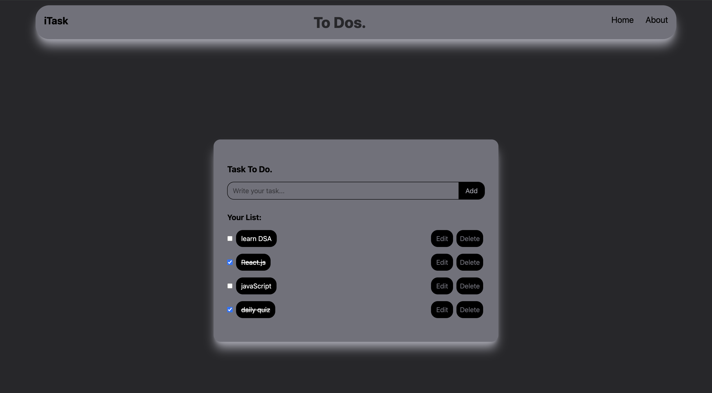

# 📝 React Todo App

A simple yet elegant Todo List application built with **React.js** and **Tailwind CSS**. It allows users to add, edit, complete, and delete tasks. All tasks are saved in **localStorage**, so your data persists even after refreshing the page.

---

## 🚀 Features

- ✅ Add new tasks
- ✏️ Edit existing tasks
- 🗑️ Delete tasks
- ✅ Mark tasks as complete/incomplete
- 💾 LocalStorage support (data persists on refresh)
- 🎨 Clean and responsive UI with Tailwind CSS

---

## 🛠️ Tech Stack

- **React.js** (Functional Components + Hooks)
- **Tailwind CSS** for styling
- **LocalStorage API** for data persistence

---

## 📦 Installation & Running Locally

1. **Clone the repository**
   ```bash
   git clone https://github.com/your-username/react-todo-app.git
   cd react-todo-app
   ```

2. **Install dependencies**
   ```bash
   npm install
   ```

3. **Start the development server**
   ```bash
   npm run dev
   ```

4. Open in browser:
   ```
   http://localhost:5173/
   ```

---

## 🧾 Project Structure

```
react-todo-app/
├── public/
├── src/
│   ├── components/
│   │   └── Navbar.jsx
│   ├── App.jsx
│   ├── App.css
│   └── main.jsx
├── package.json
├── tailwind.config.js
├── vite.config.js
└── README.md
```

---

## 📸 Screenshot



*Replace the image link above with a real screenshot if you want.*

---

## ✨ Customization Ideas

- Add due dates or reminders
- Add drag-and-drop for reordering tasks
- Use a backend (like Firebase or Supabase) for cloud sync
- Add dark/light theme toggle

---

## 📄 License

This project is open-source and free to use under the [MIT License](LICENSE).

---

## 🙋‍♂️ Author

**Krish Balana**  
Chandigarh University  
Connect on [LinkedIn](https://www.linkedin.com/) or contribute to the project on GitHub.
